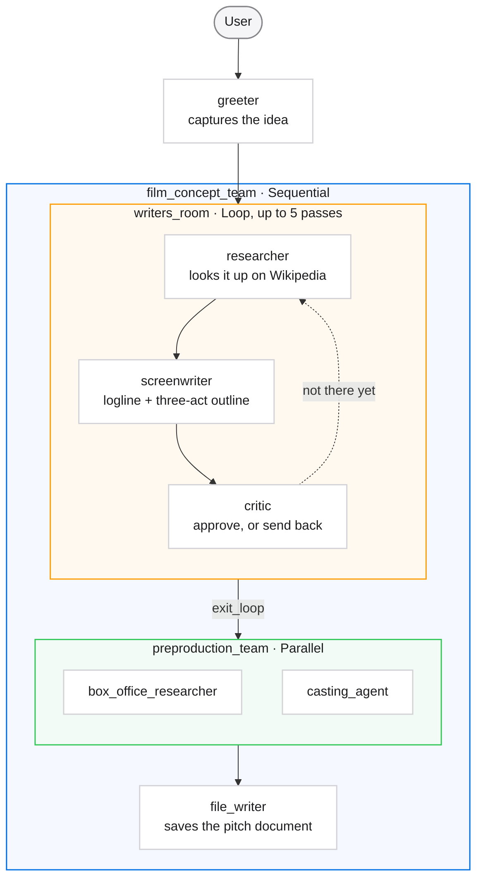
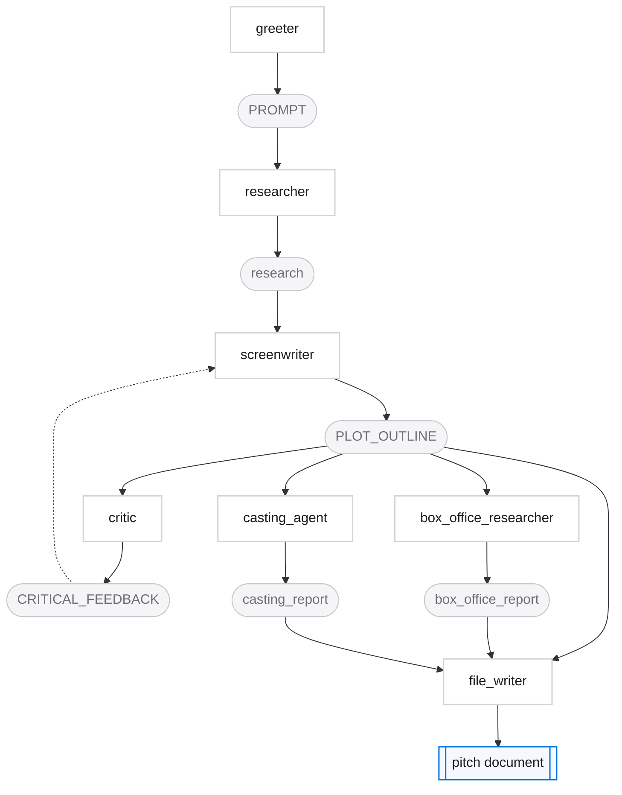

# workflow_agents

A film-pitch factory. One conversational agent takes an idea from the user, then hands it to
a pipeline that researches, drafts, critiques, revises, and finally writes a pitch document
to disk.

It exists to show the three ADK workflow primitives working together in one graph:
**Sequential** (fixed order), **Loop** (repeat until satisfied), and **Parallel**
(fan out, join).

## The hierarchy



| | Orchestrator | Runs its children |
| --- | --- | --- |
| 🟦 | `SequentialAgent` | one after another, in order |
| 🟧 | `LoopAgent` | over and over, until `exit_loop` or the cap |
| 🟩 | `ParallelAgent` | all at once, then joins |

## What runs when

| # | Agent | Type | Does |
| --- | --- | --- | --- |
| 1 | `greeter` | LlmAgent | Asks the user for a historical figure, stores the answer |
| 2 | `researcher` | LlmAgent | Wikipedia lookup for facts to write from |
| 3 | `screenwriter` | LlmAgent | Writes a logline and three-act outline |
| 4 | `critic` | LlmAgent | Reviews it — calls `exit_loop` when it is good enough |
| — | | | Steps 2–4 repeat, up to five passes |
| 5 | `box_office_researcher` | LlmAgent | Estimates commercial potential — runs with 6 |
| 6 | `casting_agent` | LlmAgent | Suggests actors — runs with 5 |
| 7 | `file_writer` | LlmAgent | Assembles everything and writes the file |

## How the state moves

Agents never call each other directly. They read and write keys on shared session state,
which is what lets the loop accumulate work across passes.



| Key | Written by | Read by |
| --- | --- | --- |
| `PROMPT` | `greeter` | `researcher`, `screenwriter` |
| `research` | `researcher` | `screenwriter`, `critic` |
| `PLOT_OUTLINE` | `screenwriter` | everyone downstream |
| `CRITICAL_FEEDBACK` | `critic` | `researcher`, `screenwriter` |
| `box_office_report` | `box_office_researcher` | `file_writer` |
| `casting_report` | `casting_agent` | `file_writer` |

`PROMPT`, `research`, `PLOT_OUTLINE` and `CRITICAL_FEEDBACK` are appended to rather than
overwritten, so each loop pass sees every earlier draft and critique. `box_office_report`
and `casting_report` use `output_key`, so each is replaced with the agent's latest answer.

## Tools

| Tool | Used by | Purpose |
| --- | --- | --- |
| `append_to_state` | greeter, researcher, screenwriter, critic | Append a value to a state key |
| `wikipedia` | researcher | LangChain's Wikipedia tool, wrapped by `LangchainTool` |
| `exit_loop` | critic | Ends `writers_room` early once the outline is good |
| `write_file` | file_writer | Writes the finished pitch to disk |

## Running it

```bash
make run-agent AGENT=workflow_agents   # terminal
make run-web                           # browser, then pick workflow_agents
```

Give it a historical figure — `albert einstein` works well. Expect several model calls per
loop pass, so a full run is not instant.

> **Note:** the Wikipedia tool needs a descriptive User-Agent — Wikimedia rejects the
> `wikipedia` package's default with a 403, which surfaces as
> `Expecting value: line 1 column 1 (char 0)`. `agent.py` sets one at import; keep it if you
> copy this tool elsewhere.

See [AGENTS.md](../../AGENTS.md) for setup, credentials, and troubleshooting.
